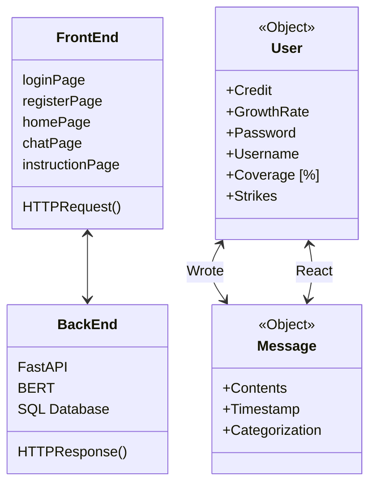

# Hackathon

Make sure you read the README.md of both the backend and the frontend.

```mermaid
classDiagram
    FrontEnd <--> BackEnd
    User <--> Message : Wrote
    User <--> Message : React

    
    class FrontEnd{
      loginPage
      registerPage
      homePage
      chatPage
      instructionPage
      
      HTTPRequest()
    }
    class BackEnd{
        HTTPResponse()
        FastAPI
        BERT
        SQL Database
    }

    class User{
        <<Object>>
        +Credit
        +GrowthRate
        +Password
        +Username
        +Coverage [%]
        +Strikes
    }

    class Message{
        <<Object>>
        +Contents
        +Timestamp
        +Categorization
    }


```
